# SynCore Tool Workflow Mapping

This document provides a comprehensive mapping of all SynCore tool workflows, data paths, database interactions, state mutations, and contamination risks based on real source code analysis.

## Table of Contents

1. [Phase 0: Tool Enumeration](#phase-0-tool-enumeration)
2. [Phase 1: MCP Server Workflow](#phase-1-mcp-server-workflow)
3. [Phase 2: Memory Suite Tools](#phase-2-memory-suite-tools)
4. [Phase 3: Code Suite Tools](#phase-3-code-suite-tools)
5. [Phase 4: Graph Suite Tools](#phase-4-graph-suite-tools)
6. [Phase 5: Mapping Suite Tools](#phase-5-mapping-suite-tools)
7. [Phase 6: Live Indexer + FS Watcher](#phase-6-live-indexer--fs-watcher)
8. [Phase 7: HNSW Vector Store](#phase-7-hnsw-vector-store)
9. [Phase 8: SQLite Data Layer](#phase-8-sqlite-data-layer)
10. [Contamination Risk Summary](#contamination-risk-summary)

---

## Phase 0: Tool Enumeration

### Discovered Tool Architecture

SynCore uses a **unified suite architecture** with 5 main tool suites:

1. **memory_suite** - Memory and vector operations
2. **code_suite** - Code indexing, search, and analysis  
3. **graph_suite** - Neo4j graph operations
4. **mapping_suite** - Application structure mapping
5. **debug_suite** - Debugging, logs, and diagnostics

### Tool Registration Pattern

```rust
// Located in: src/mcp_server/server.rs
#[tool_router]
impl SynCoreMCPServer {
    // Tools are registered via rmcp's tool_router macro
    // Each tool delegates to RealExecutor.execute_real_tool_async()
}
```

### Entry Points

- **STDIO**: `src/mcp_stdio_main.rs:473` → `run_mcp_stdio_server()`
- **HTTP**: `src/http_stream_server.rs:36` → `StreamableHttpService`

---

## Phase 1: MCP Server Workflow

### MCP Server Architecture

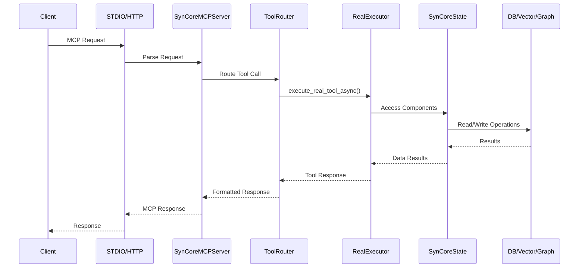

### Data Flow Architecture

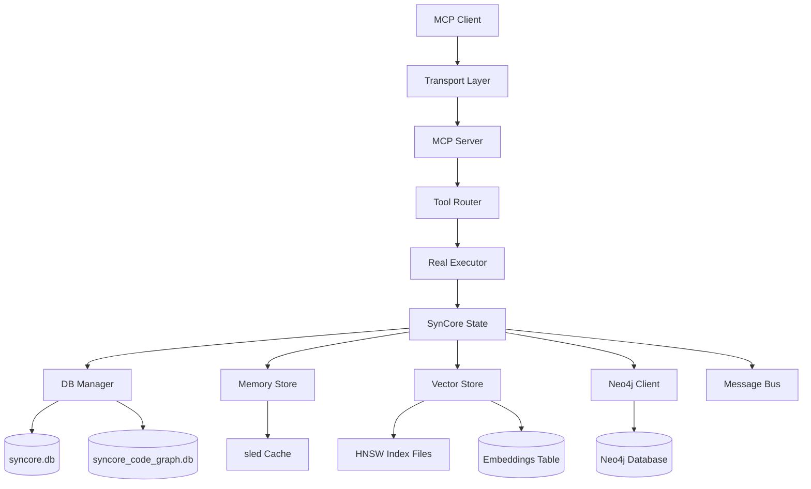

### State Management

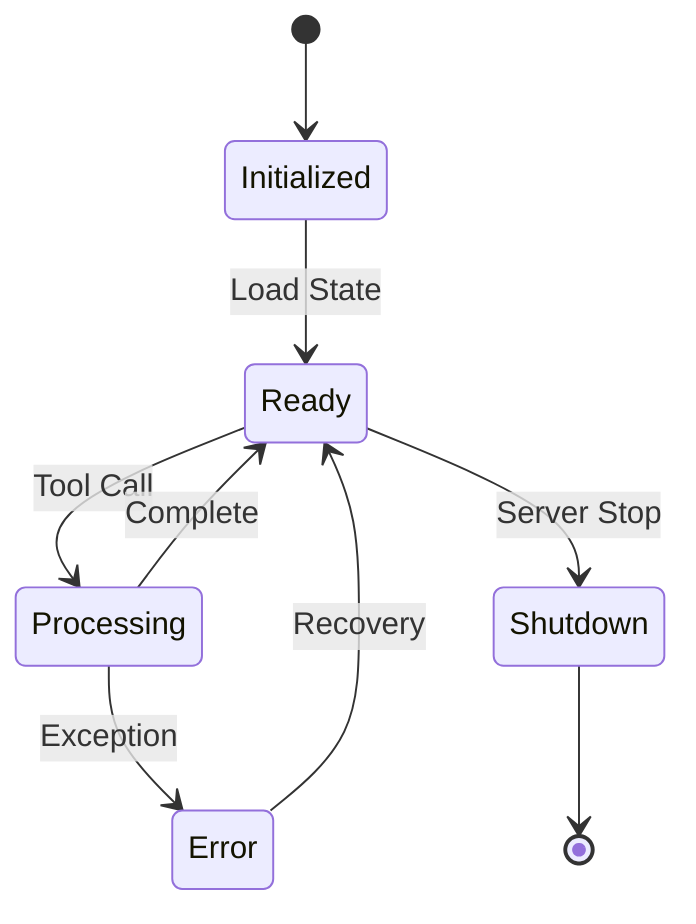

---

## Phase 2: Memory Suite Tools

### Memory Suite Architecture

**Location**: `src/mcp_tools/memory_suite/mod.rs`

### Commands Overview

- `store` - Store key-value pair
- `query` - Query value by key  
- `vector_insert` - Insert text into vector store
- `vector_search` - Semantic search
- `task_create` - Create new task
- `sequential_record` - Record reasoning step
- `agent_register` - Register agent
- `agent_list` - List agents

### Memory Store Workflow

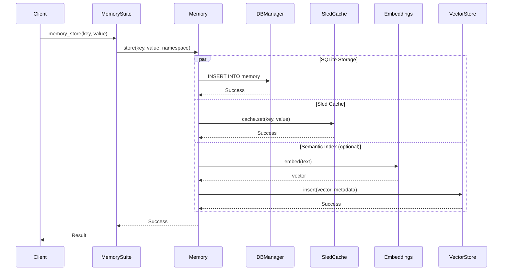

### Memory Data Flow

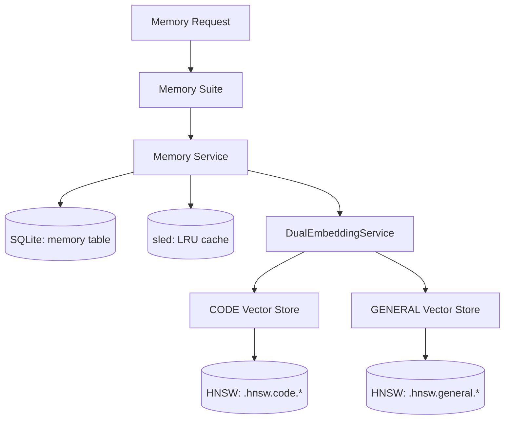

### Memory Contamination Risks

| Risk | Component | Impact | Mitigation |
|------|-----------|--------|------------|
| Working Directory Pollution | Sled cache files | Medium | Uses temp dirs for in-memory DBs |
| Unbounded Growth | SQLite memory table | High | No automatic cleanup mechanism |
| Cache Inconsistency | SQLite ↔ Sled sync | Medium | Eventual consistency model |
| Embedding Bloat | Vector stores | High | No automatic vector pruning |
| Race Conditions | Concurrent access | Medium | Arc<Mutex<>> protection |

---

## Phase 3: Code Suite Tools

### Code Suite Architecture

**Location**: `src/mcp_tools/code_suite.rs`

### Commands Overview

- `index` - Index single file
- `index_directory` - Index directory with pattern
- `search` - Semantic code search
- `parse` - Parse with tree-sitter
- `grep` - Pattern search with ripgrep
- `doc_index` - Index documents
- `doc_search` - Search documents
- `explain` - Function explanation
- `sync_neo4j` - Sync to Neo4j
- `enrich_temporal` - Add temporal metadata
- `fusion_query` - Tri-mode RAG query

### Code Indexing Workflow

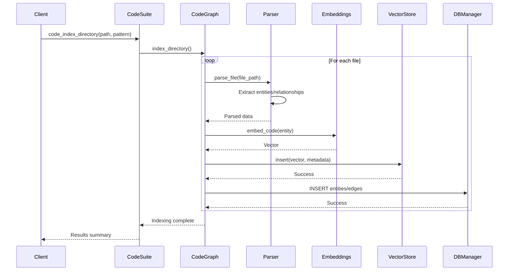

### Code Data Flow

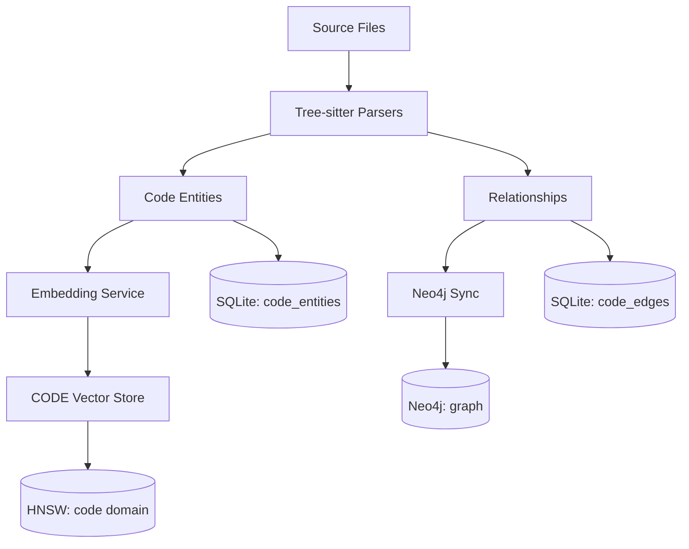

### Code Suite Contamination Risks

| Risk | Component | Impact | Mitigation |
|------|-----------|--------|------------|
| File System Scanning | Directory traversal | Medium | Pattern filtering, excluded dirs |
| Embedding Model Bloat | Vector store growth | High | No automatic pruning |
| Parser Memory Leaks | Tree-sitter parsing | Medium | RAII cleanup in parsers |
| Neo4j Sync Failures | Graph inconsistency | High | Fallback to SQLite-only |
| Incremental Index Bugs | Stale entities | Medium | SHA256 change detection |

---

## Phase 4: Graph Suite Tools

### Graph Suite Architecture

**Location**: `src/mcp_tools/graph_suite.rs`

### Commands Overview

- `query` - Execute Cypher query
- `insert` - Insert nodes/relationships
- `relate` - Create relationships
- `help` - Show commands

### Graph Suite Workflow

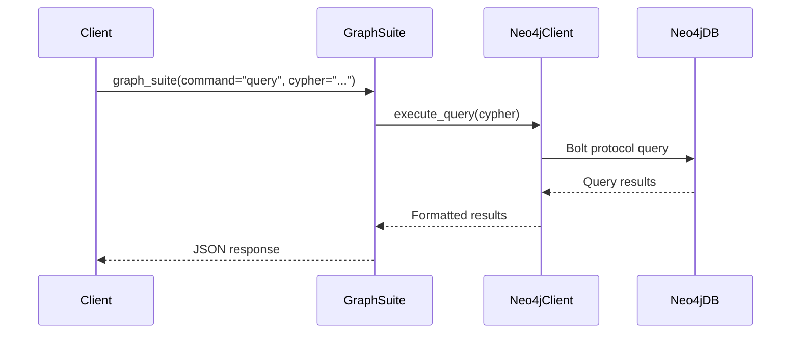

### Graph Data Flow

```mermaid
flowchart TD
    Request[Graph Request] --> GraphSuite[Graph Suite]
    GraphSuite --> Neo4jClient[Neo4j Client]
    
    Neo4jClient --> Neo4jDB[(Neo4j Database)]
    
    alt Neo4j Unavailable
        Neo4jClient --> Fallback[Silent Failure]
        Fallback --> Error[Error Response]
    else Neo4j Available
        Neo4jDB --> Results[Query Results]
        Results --> GraphSuite
        GraphSuite --> Response[Success Response]
    end
```

### Graph Suite Contamination Risks

| Risk | Component | Impact | Mitigation |
|------|-----------|--------|------------|
| Neo4j Connection Loss | Service availability | Medium | Silent fallback to error |
| Cypher Injection | Query security | High | Parameterized queries |
| Graph Bloat | Unbounded growth | High | No automatic cleanup |
| Relationship Inconsistency | Data integrity | Medium | Transactional operations |
| Bolt Protocol Issues | Network failures | Low | Connection pooling |

---

## Phase 5: Mapping Suite Tools

### Mapping Suite Architecture

**Location**: `src/mcp_tools/mapping_suite.rs`

### Commands Overview

- `record` - Record file node
- `get` - Get file node
- `search` - Search files
- `deps` - Get dependencies
- `help` - Show commands

### Mapping Data Flow

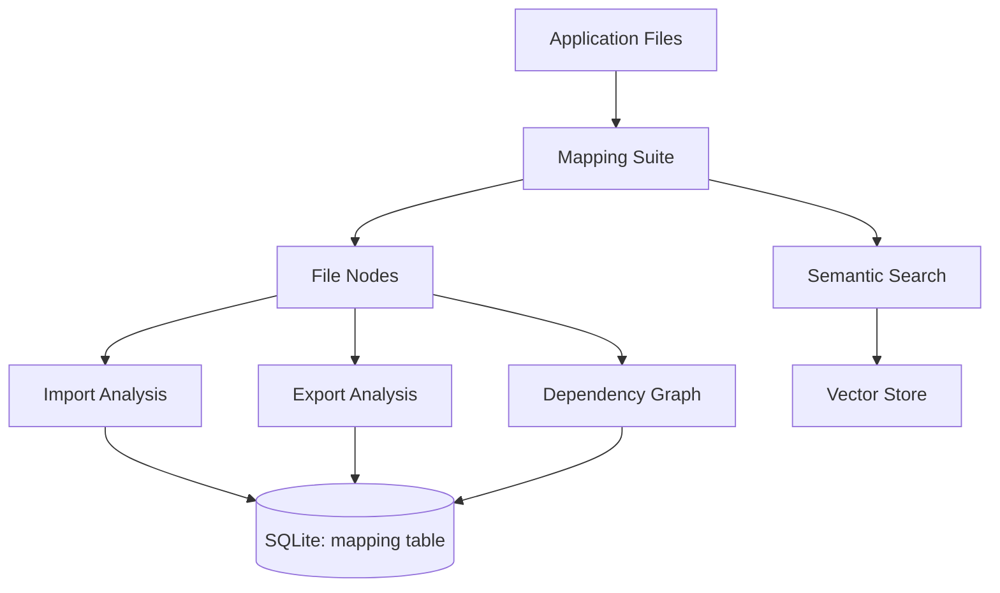

### Mapping Contamination Risks

| Risk | Component | Impact | Mitigation |
|------|-----------|--------|------------|
| Stale Dependency Cache | Outdated mappings | Medium | No automatic refresh |
| Circular Dependencies | Infinite loops | Low | Cycle detection |
| File System Changes | Missing files | Medium | Path validation |
| Import Analysis Errors | Incomplete graphs | Medium | Error propagation |

---

## Phase 6: Live Indexer + FS Watcher

### Live Indexing Architecture

**Locations**: 
- `src/live_indexer/mod.rs`
- `src/fs_watcher/mod.rs` 
- `src/embedding_refresh/mod.rs`

### Live Indexing Workflow

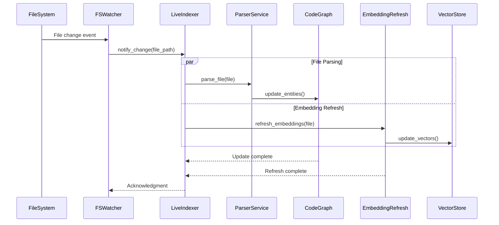

### Live Indexing Data Flow

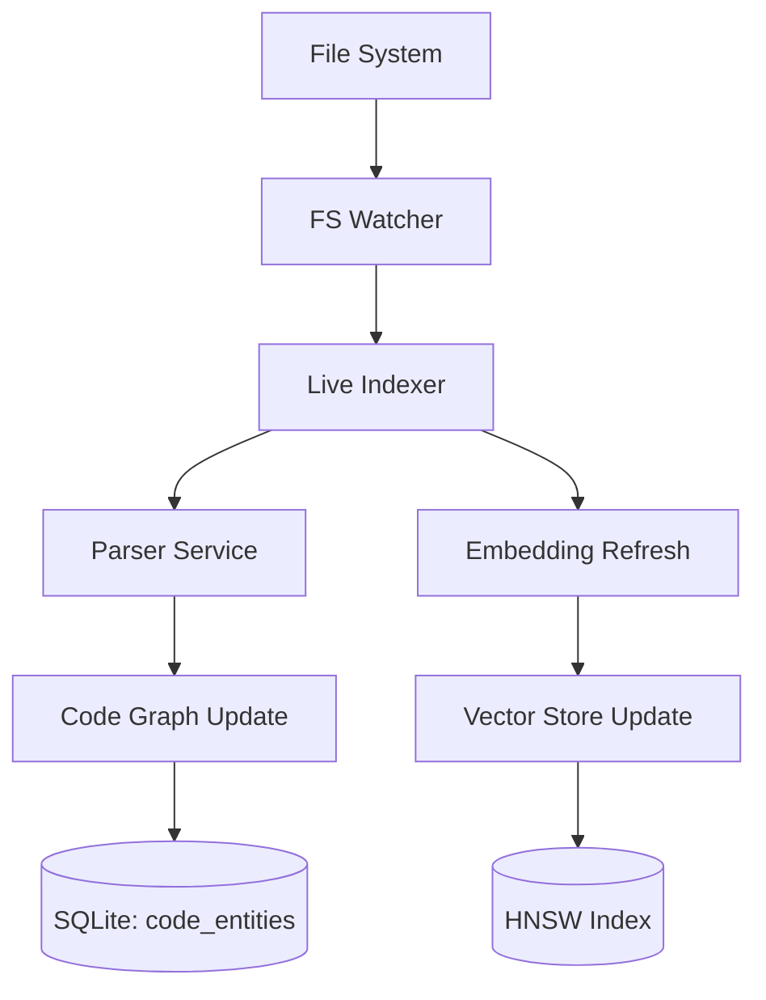

### Live Indexing Contamination Risks

| Risk | Component | Impact | Mitigation |
|------|-----------|--------|------------|
| File Event Storm | System overload | High | Event throttling |
| Partial Updates | Inconsistent state | Medium | Transactional updates |
| Watcher Disconnection | Missed changes | High | Reconnection logic |
| Memory Leaks | Indexer growth | Medium | Bounded queues |
| Race Conditions | Concurrent updates | High | Mutex protection |

---

## Phase 7: HNSW Vector Store

### HNSW Architecture

**Location**: `src/vector/hnsw/hnsw_index.rs`

### HNSW File Structure

```
.hnsw.data      - Vector data
.hnsw.graph     - HNSW graph structure  
.index.vectors  - Vector metadata
.index.meta     - Index metadata
```

### HNSW Workflow

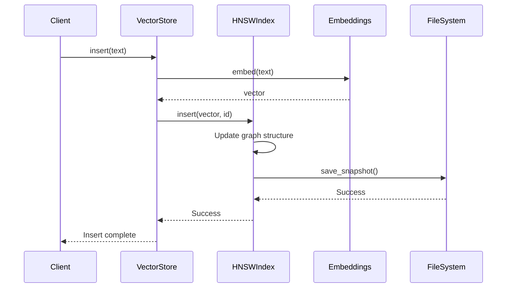

### HNSW Data Flow

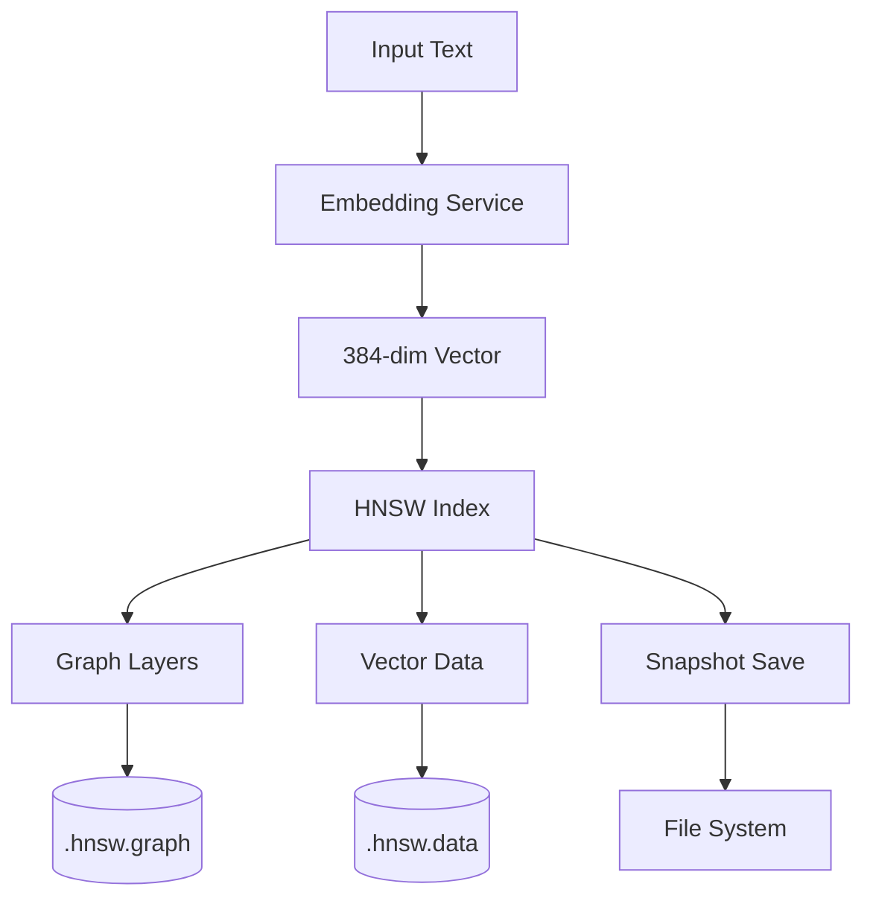

### HNSW Contamination Risks

| Risk | Component | Impact | Mitigation |
|------|-----------|--------|------------|
| Index Corruption | File I/O errors | Critical | Atomic writes |
| Memory Bloat | Unbounded growth | High | No automatic pruning |
| Snapshot Failures | Data loss | High | Error recovery |
| Concurrent Access | Race conditions | Medium | RwLock protection |
| Disk Space | Index file size | Medium | Compression |

---

## Phase 8: SQLite Data Layer

### Database Architecture

**Location**: `src/db/manager.rs`

### Database Files

- `syncore.db` - Main database (memory, tasks, embeddings)
- `syncore_code_graph.db` - Code graph database (entities, edges)

### SQLite Schema

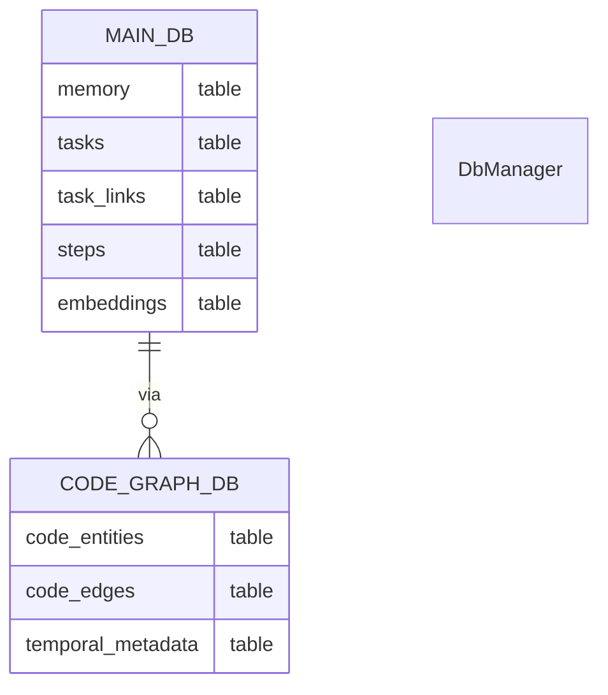

### DB Manager Workflow

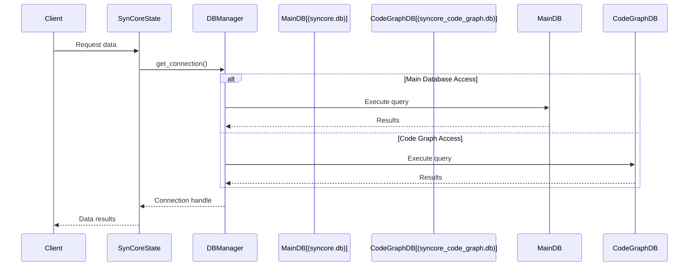

### SQLite Contamination Risks

| Risk | Component | Impact | Mitigation |
|------|-----------|--------|------------|
| WAL Corruption | Connection management | Critical | Long-lived connections |
| Schema Migrations | Incompatible changes | High | Versioned migrations |
| Lock Contention | Concurrent access | Medium | WAL mode |
| Database Bloat | Unbounded growth | High | No vacuum mechanism |
| Transaction Deadlocks | Complex queries | Medium | Timeout handling |

---

## Contamination Risk Summary

### Critical Risks (Immediate Attention Required)

1. **Unbounded Data Growth** - No automatic cleanup in vector stores, memory tables, or databases
2. **WAL Corruption** - Short-lived connections can cause data loss
3. **Index Corruption** - HNSW snapshot failures can lose vector data

### High Risks

1. **Memory Leaks** - Live indexer and embedding refresh can grow without bounds
2. **Cache Inconsistency** - SQLite ↔ Sled cache synchronization issues
3. **File System Pollution** - Temporary files and cache directories

### Medium Risks

1. **Race Conditions** - Concurrent access to shared state
2. **Stale Data** - Incremental indexing may miss edge cases
3. **Service Dependencies** - Neo4j/Ollama failures cause silent degradation

### Low Risks

1. **Network Issues** - Neo4j Bolt protocol failures
2. **Parser Errors** - Tree-sitter parsing failures
3. **Configuration Issues** - Missing or invalid config files

### Recommended Mitigations

1. **Implement Data Retention Policies** - Automatic cleanup of old data
2. **Add Connection Pooling** - Prevent WAL corruption
3. **Add Health Checks** - Monitor service dependencies
4. **Implement Backpressure** - Prevent file event storms
5. **Add Data Validation** - Prevent corruption at ingestion time

---

## Conclusion

This mapping reveals that SynCore has a sophisticated but complex architecture with multiple data stores, concurrent processes, and potential contamination points. The most critical risks involve unbounded data growth and database corruption, which should be addressed with immediate priority.

The unified suite architecture provides good organization, but the complexity of interactions between components requires careful monitoring and robust error handling to prevent data contamination and system instability.